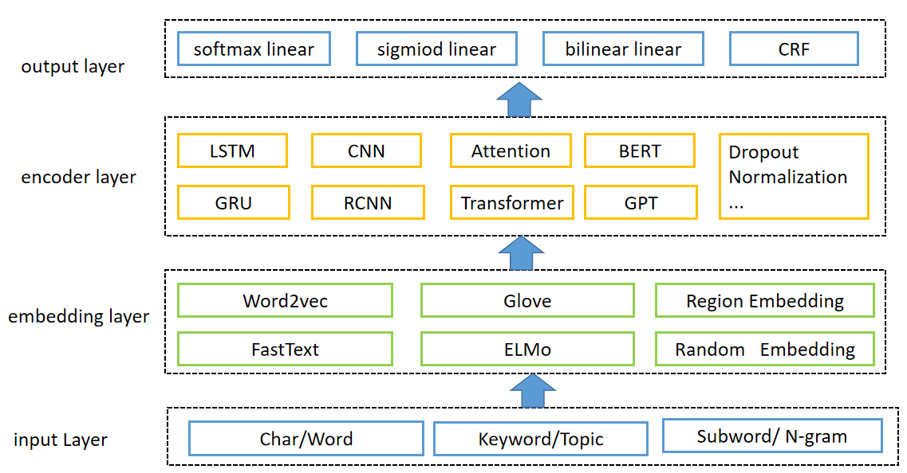

# opennlp
早期实现的一个自然语言处理框架，v0版本只包含部分算法，目前已经更新到v6版本，支持更多算法。如需全量代码请联系我。
## 特点
    将分类、多标签分类、序列标注、句对相似、句对分类、表示学习等任务统一在一套算法框架下
    通过积木化的模块设计实现了对金典模型的快速复现和原型验证
    通过合理组合创造新的模型结构，将创新以模块化的设计快速的融入系统框架下

## 整体架构图
